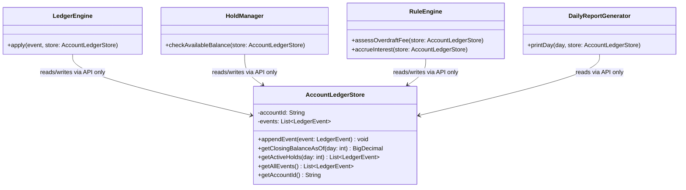

# AccountLedgerStore — Design

## Why not a raw List/Map?

Callers (Rule Engine, Report Generator, Hold Manager) don't want to reimplement
"filter events by value_date <= day and sum" every time they need a balance —
that logic would get duplicated and risk subtle inconsistencies between callers.
`AccountLedgerStore` owns that logic once, behind a small, purpose-built API.

## Shape

## Design principles

1. **Internal storage is hidden.** Whether events are stored as a `List`, sorted by value_date, or indexed some other way is an implementation detail inside `AccountLedgerStore`. Callers never see it.
2. **Append-only is enforced at the boundary.** `appendEvent` is the *only* write path — there is no `update` or `delete` method, so the append-only constraint isn't just a convention, it's structurally impossible to violate through this API.
3. **Retroactive queries are a first-class case, not an afterthought.** `getClosingBalanceAsOf(day)` takes a day parameter specifically because the spec requires recomputing historical balances after later events with earlier value_dates arrive (e.g., E7's backdated debit). This is why we didn't just cache a single running "current balance" — a mutable running total can't answer "what was the balance at Day 2, given everything known by Day 5."
4. **One store per account.** Each account gets its own `AccountLedgerStore` instance — no cross-account state ever gets shared or confused inside this class.

## Open question (→ AMBIGUITIES.md candidate)

Does `getClosingBalanceAsOf(day)` recompute from scratch every call (simple, always correct, but O(n) per query), or should it maintain some incremental/cached structure? Given the dataset here is 10 events across 6 days, performance is a non-issue — recompute-from-scratch is the honest, simple choice, and premature caching would be over-engineering for this scale. Worth stating explicitly in NUMBERS.md or AMBIGUITIES.md as a deliberate simplicity trade-off, not an oversight.
