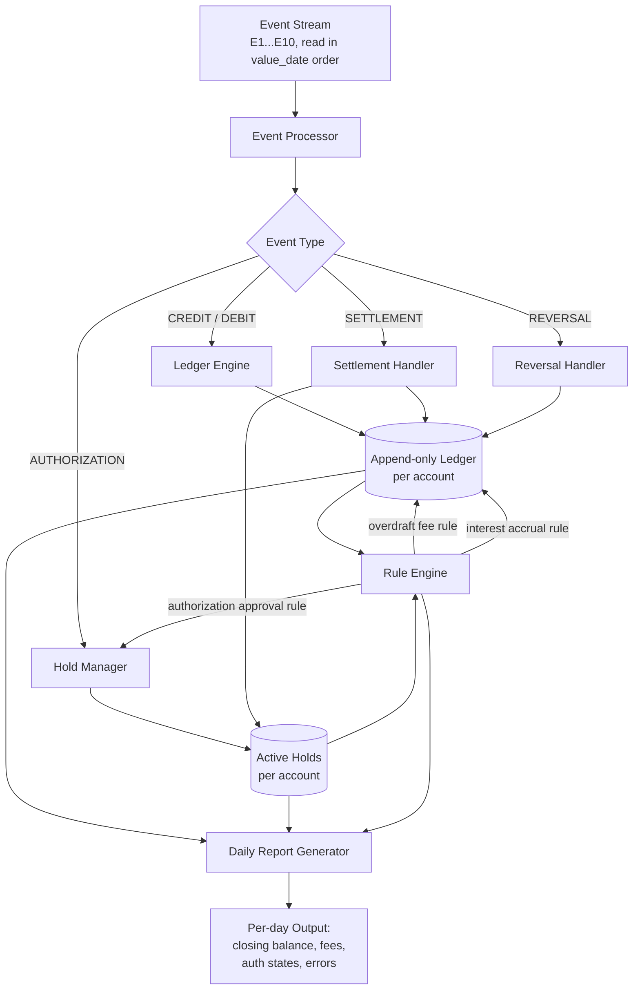

# Architecture — In-Memory Account Ledger Core

**Status: v1 — draft, will evolve as data model and event analysis are finalized.**

## High-level flow

## Rule Engine — sits between state and reporting, consulted by multiple components

The Rule Engine isn't a downstream step — it's a **shared decision layer** that both the Ledger Engine and Hold Manager consult:
- **Ledger Engine** asks the Rule Engine: "given this closing balance, is an overdraft fee due? is interest due?"
- **Hold Manager** asks the Rule Engine: "given this ledger balance and these active holds, is this new authorization approvable?"
- The **Daily Report Generator** also queries the Rule Engine directly when explaining *why* a fee/rejection occurred, not just *that* it occurred

This keeps the three non-negotiable rules (overdraft fee, interest, authorization approval) in one place, rather than scattered across the Ledger Engine and Hold Manager as ad-hoc checks.

## Components (first pass — names/responsibilities will firm up in Section 1)

| Component | Responsibility |
|---|---|
| **Event Processor** | Reads the fixed event stream, dispatches each event to the correct handler based on type |
| **Ledger Engine** | Applies credits/debits to an account's append-only entry list; computes closing ledger balance as of a given day |
| **Hold Manager** | Tracks active authorization holds per account; computes available balance (ledger balance − active holds) |
| **Settlement Handler** | Resolves a settlement against a prior authorization; rejects settlements with no matching prior auth (e.g., E6/Auth-Z) |
| **Reversal Handler** | Applies a reversal against a prior event without mutating/deleting the original (append-only constraint) |
| **Rule Engine** | Central decision layer for the three non-negotiable rules: overdraft fee assessment, daily interest accrual, and authorization approval (available balance ≥ 0). Consulted by Ledger Engine and Hold Manager rather than embedding rule logic in each. |
| **Daily Report Generator** | Iterates Day 1–6 and prints closing balance, fees, auth states, and errors per account per day |

## Open questions this diagram doesn't yet resolve
(To be moved into `AMBIGUITIES.md` as we work through Section 3)
- Does a REVERSAL create a new ledger entry (append-only, offsetting) or is it a distinct event type the balance calculation must special-case?
- Where does "closing balance evaluated at end of Day 5" (a retroactive recompute, per the acceptance criteria) fit — is this a re-query capability of the Ledger Engine, or a separate historical-recompute path?
- Order of operations within a single day when both fee assessment and interest accrual apply — does fee get assessed before interest is calculated on the same closing balance?
